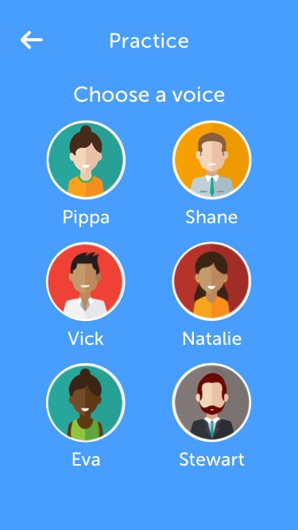

<h1 style="text-align:center;">UCL Accent Vowel Trainer App</h1>
<h2 style="text-align:center;">A simple app for those learning English as a second language to recognise different spoken english accents</h2>

In collaboration with UCL Speech Sciences our duo built an iOS application that improves the ability of users to recognise different English accents. It works by quizzing users on their recognition of specific vowel sounds. Sounds that users have trouble with come up more often.

##Features
Select from **six** different accents in multiple voices

    
    

Practice mode to quiz yourself on specific vowel sounds, with feedback

Timetrial mode to test your speed

Highscores to see how far you've come

##ToDos
* Implement autolayout correctly
* Move out code to nibs

##Credits
Design: Mujavid (check out the Sketch file to see the complete design set)
Developement: Mujavid and Kazuma
