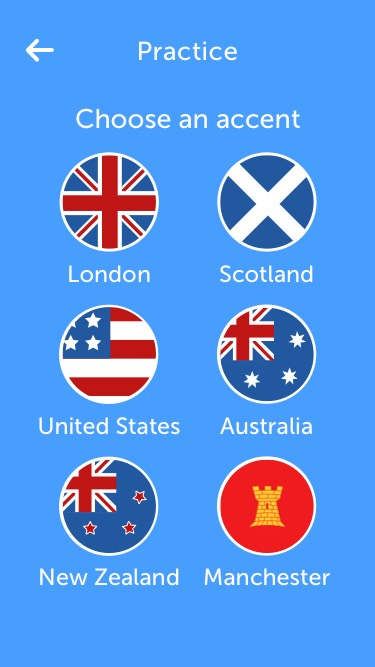

#UCL Accent Vowel Trainer App
###Learn and recognise different English accents

In collaboration with UCL Speech Sciences our duo built an iOS application that improves the ability of users to recognise different English accents. It works by quizzing users on their recognition of specific vowel sounds. Sounds that users have trouble with come up more often.

##Features
####Select from **six** different accents in multiple voices

####Practice mode to quiz yourself on specific vowel sounds, with feedback

####Timetrial mode to test your speed

####Highscores to see how far you've come

##ToDos
* Implement autolayout correctly
* Move out code to nibs

##Credits
* Design: Mujavid (check out the Sketch file to see the complete design set)
* Development: Mujavid and Kazuma
